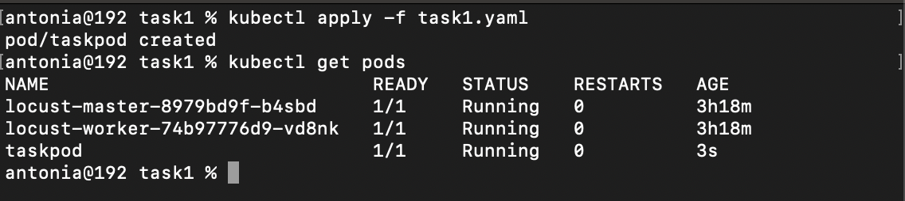
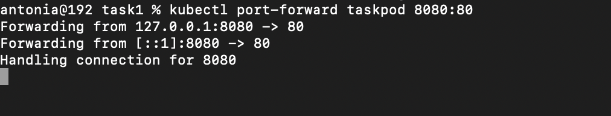
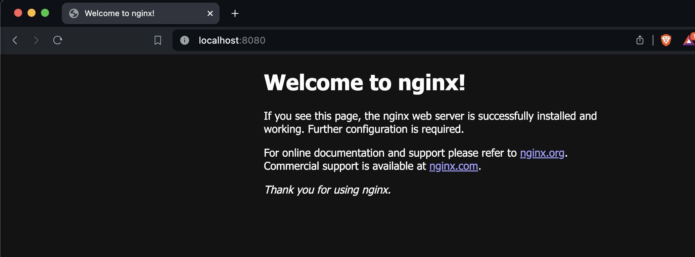
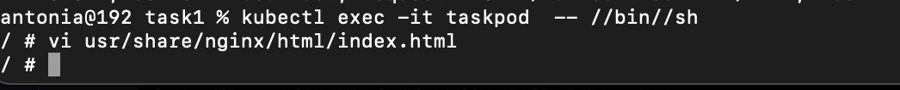
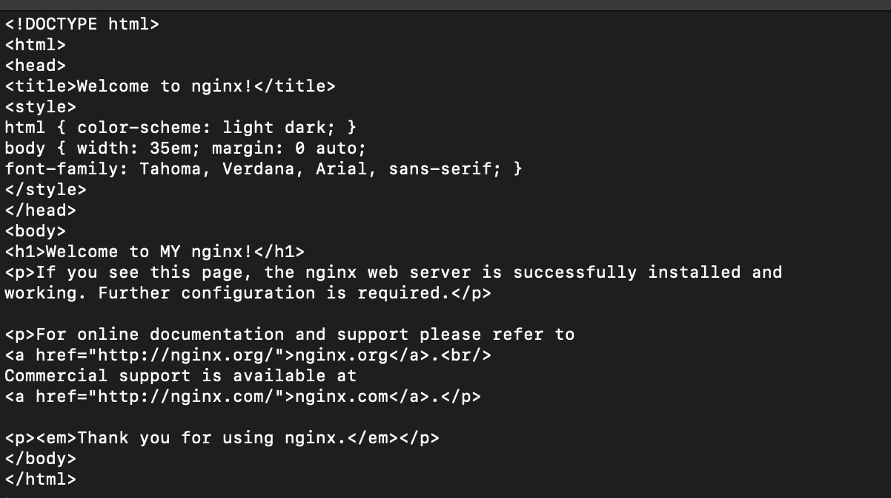
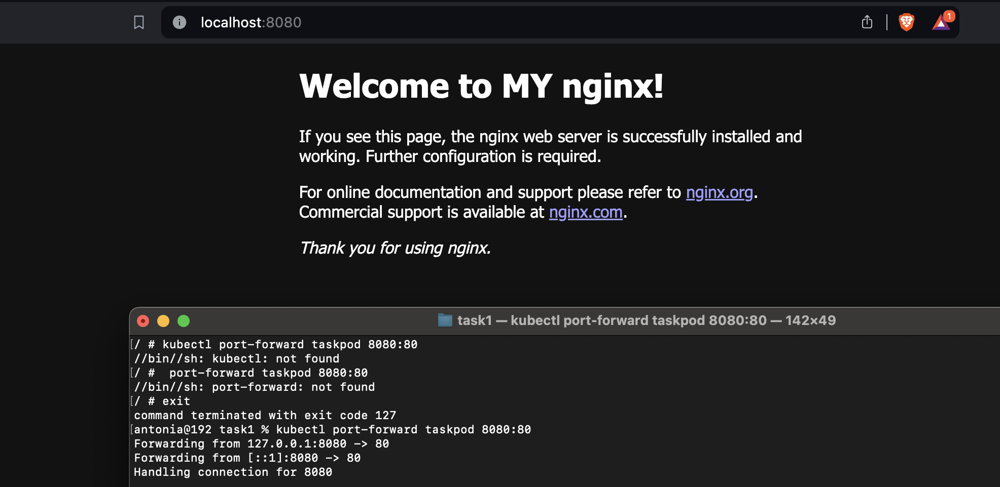
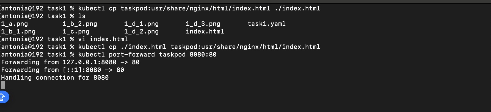
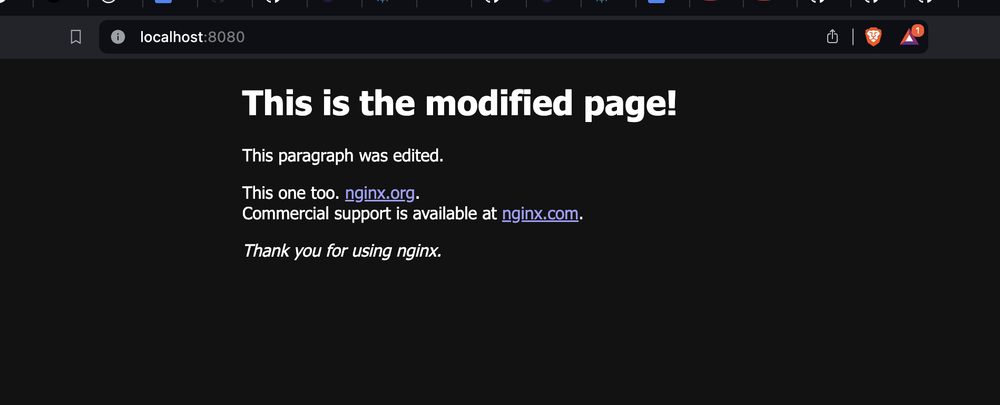
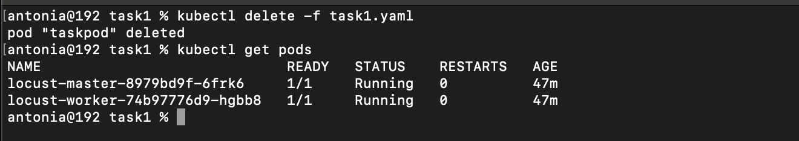

# Assignment 2
---------------------
## csd4140 | Antonia Krasoudaki

### Task 1

* a  )
  
Apply manifest and start the pod using the command :

  kubectl apply -f task1.yaml

 

 * b )
   
Forward to localhost port 80 using the command : kubectl port-forward taskpod 8080:80

 
 

 * c )
   
To view the logs we use the command : kubectl logs taskpod
 

  * d )
  * 
Create the shell session with the command: kubectl exec -it taskpod  -- //bin//sh
 

Modify the html file:
 

Localhost after modifying : 

 

 * e )

Copy html file from container to local machine with the command : kubectl cp taskpod:usr/share/nginx/html/index.html ./index.html
Copy modified html file from local machine to container with the command : kubectl cp ./index.html taskpod:usr/share/nginx/html/index.html

  

Modified page:

  

* f )

Stopping the pod and removing the yaml file with the command : kubectl delete -f task1.yaml

 

