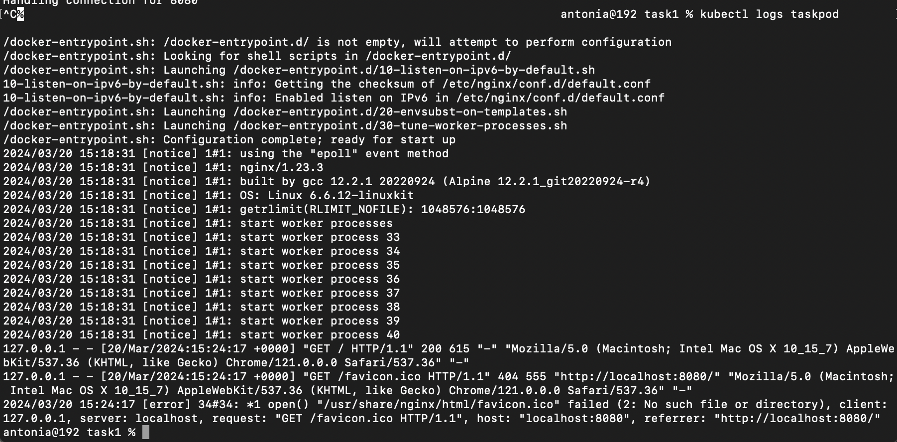
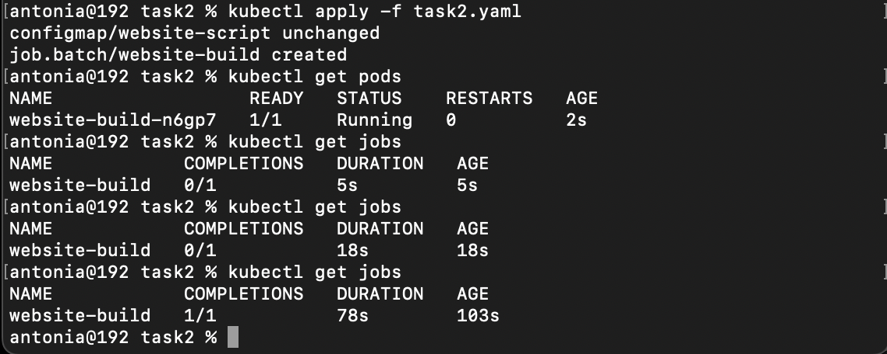
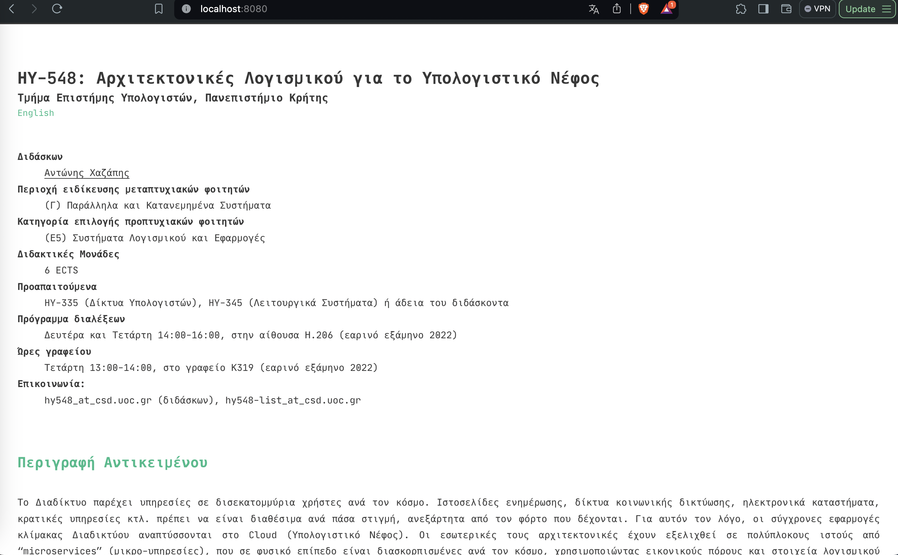

# Assignment 2
---------------------
## csd4140 | Antonia Krasoudaki

### Task 1

* a  )
  
Apply manifest and start the pod using the command :

  kubectl apply -f task1.yaml

 

 * b )
   
Forward to localhost port 80 using the command : kubectl port-forward taskpod 8080:80

 
 

 * c )
   
To view the logs we use the command : kubectl logs taskpod
 

  * d )
  * 
Create the shell session with the command: kubectl exec -it taskpod  -- //bin//sh
 

Modify the html file:
 

Localhost after modifying : 

 

 * e )

Copy html file from container to local machine with the command : kubectl cp taskpod:usr/share/nginx/html/index.html ./index.html
Copy modified html file from local machine to container with the command : kubectl cp ./index.html taskpod:usr/share/nginx/html/index.html

  

Modified page:

  

* f )

Stopping the pod and removing the yaml file with the command : kubectl delete -f task1.yaml

 

### Task 2

The config map named website-script builds the script that installs the appropriate dependencies like git, make and curl downloads hugo and clones
the github repository. The job that runs on the ubuntu container mounts the config map and executes the command  ["/bin/sh", "-c", "bash /config/website-script.sh"] runs the script and builds the website.

The commands kubectl get pods and kubectl get jobs were executed to make sure everything was running smoothly. And minikube dashboard displays the memory and CPU usage of the pod.

### Task 3

The data is communicated between containers using the config maps and volumes. This allows task coordination and execution of the scripts website-script.sh and refresh.sh by the containers. The script-volume volume is defined and mounted into the containers by using the volumeMounts field. This volume is associated with the website-script config map, giving permission to the containers to access website-script.sh script. The contents of the website-script.sh script are accessible to the containers at the mount path /config since the script-volume volume is configured to use the website-script ConfigMap. The containers: taskcontainer, website-build, and refresh can communicate using the shared volume. By adding the script-volume volume the website-build and refresh they can access the website-script.sh and refresh.sh scripts. 

screenshot from minikube dashboard to make sure the cronjob is running smoothly:

website-build logs:

website-refresh logs:

localhost 8080:

### Task 4

